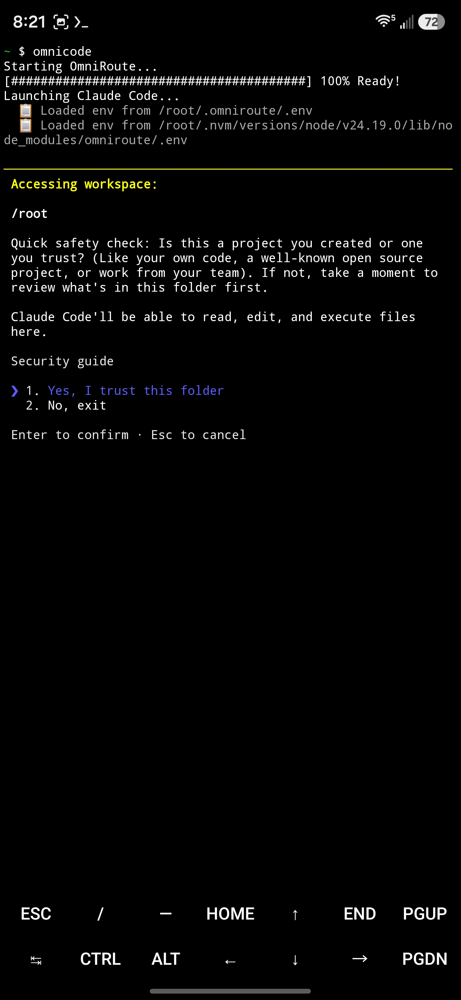
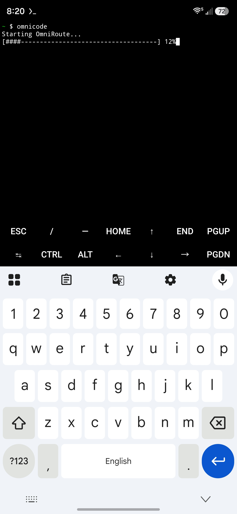
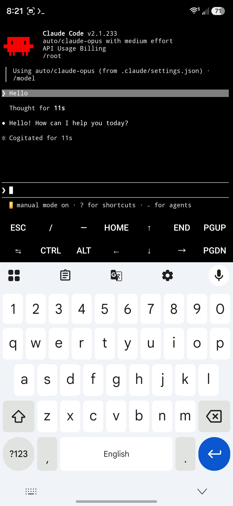

# OmniRouteTermuntu

A one-command launcher that starts OmniRoute (https://github.com/diegosouzapw/OmniRoute) and Claude Code from a fresh Termux session on Android - no manual server-start, no separate terminal tabs, no waiting around wondering if it's stuck.

This is NOT OmniRoute itself. It's a small addon script that automates the Android/Termux-specific setup steps OmniRoute's own docs don't cover: running it inside a proot-distro Ubuntu environment (required because Claude Code's native binary isn't built for Android), fixing a Node.js patch-version bug that silently breaks OmniRoute's server, and wiring the whole thing into a single alias.

## What it does

Typing omnicode in plain Termux will:
1. Log into your proot-distro Ubuntu environment
2. Load Node.js 24 via nvm
3. Start the OmniRoute server in the background
4. Show a live progress bar while it waits for the server to become healthy
5. Launch Claude Code, pointed at your local OmniRoute gateway

## Why this exists

Running Claude Code directly in plain Termux fails - the native binary isn't published for linux-arm64-android, only standard Linux/macOS/Windows targets. Running it inside a proot-distro Ubuntu environment fixes that (it reports as normal linux-arm64), but that introduces its own rough edges:

- Ubuntu's default nodejs package (22.22.1) is one patch version behind OmniRoute's required minimum (22.22.2+). This doesn't throw a clear error - the server starts but silently returns Internal Server Error on real requests. The fix is installing a newer Node via nvm.
- Backgrounding the OmniRoute server naively inside a wrapped proot-distro login call can get torn down when the wrapping shell exits, so it needs nohup and disown and to be started from inside a persistent script.
- proot-distro shares Termux's network namespace, so localhost works the same across both.

## Prerequisites

- Termux with proot-distro and an Ubuntu container set up
- Node.js and npm installed inside that Ubuntu environment
- OmniRoute installed globally inside Ubuntu (npm install -g omniroute)
- Claude Code installed globally inside Ubuntu (npm install -g @anthropic-ai/claude-code)

## Setup

1. Inside Ubuntu, install nvm and Node 24:
   curl -o- https://raw.githubusercontent.com/nvm-sh/nvm/v0.40.1/install.sh | bash
   source ~/.bashrc
   nvm install 24
   nvm use 24

2. Reinstall OmniRoute and Claude Code under the new Node version:
   npm install -g omniroute
   npm install -g @anthropic-ai/claude-code

3. Save omniroute-start.sh to ~/omniroute-start.sh inside Ubuntu, then:
   chmod +x ~/omniroute-start.sh

4. Back in plain Termux, add this alias to ~/.bashrc:
   alias omnicode='proot-distro login ubuntu -- bash -c "~/omniroute-start.sh"'

5. From a fresh Termux session:
   omnicode

## Important note on model quality

OmniRoute's free-tier routing (e.g. auto, auto/claude-opus) does NOT call real Anthropic models on the free tier - it substitutes other providers' models under Claude-shaped labels so Claude Code's UI/config work correctly. Response quality, behavior, and capability will differ from actual Claude models. Check omniroute models to see the real backend model IDs. If you want genuine Claude responses, add your own Anthropic API key as a provider in OmniRoute's config.

## Credit

Built on top of OmniRoute (https://github.com/diegosouzapw/OmniRoute) (MIT licensed) and Claude Code (https://www.npmjs.com/package/@anthropic-ai/claude-code). This repo only provides the Android/Termux launcher wrapper - all routing/gateway functionality belongs to the upstream OmniRoute project.

## License

MIT

## Screenshots

Progress bar while OmniRoute starts up:

Claude Code launched and responding through the free gateway:

Trusting the workspace and connecting through the gateway:

## Development note

Built with help from Claude (Anthropic) for debugging and scripting.

## Dashboard

Once `omnicode` (or `omniroute serve`) is running, you can view OmniRoute's dashboard in your phone's browser at:

http://localhost:20128

From there you can see live provider status, usage/cost analytics, add API keys or subscriptions, and manage routing combos — all without touching the command line.
